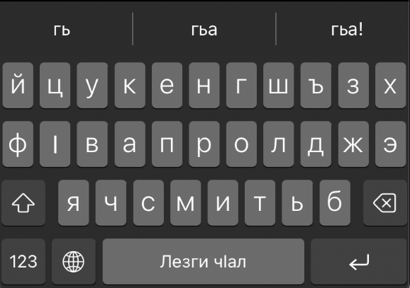

# Лезгинская клавиатура
Клавиатура с лезгинской раскладкой на ios

Это приложение предназначеное на iOS позволяет пользователю добавить лезгинскую клавиатуру на свой телефон

Лезгинская клавиатура поддерживает подсказки/автокоррекцию лезгинских слов и приходит в 2-ух раскладках:
|        |Лезги чIал | Лезги чIал: Вири гьарфар |
| ------ | ---- | ---- |
| iPhone | |  |
| iPad   | |  |
## Исходный код

Для имплементации клавиатуры была использована библиотека [KeyboardKit Swift Library](https://github.com/KeyboardKit/KeyboardKit), их документацию можно найти здесь [KeyboardKit | Documentation](https://keyboardkit.github.io/KeyboardKit/documentation/keyboardkit/)

Слова для подсказок были взяты из книги "ЛЕЗГИНСКО-РУССКИЙ СЛОВАРЬ 2018 (Бабаханов М.Б)" и извлеченной в цифровом виде с лезгинского онлайн переводчика и словаря https://www.gafalag.com

Для правильной работы нужно окрывать этот проект на Xcode через `LezgiKeyboard.xcworkspace`

Структура:
- `LezgiKeyboard` - это проект самого приложения, в нем в оснавном имплементирована инструкция и нет особо важного функционала
  - `ContentView.swift` - главная страница приложения где даётся выбор инструкции к каждой из 2-ух раскладок
  - `LezgiKeyboardApp.swift` - непосредственно страница с инструкцией динамично меняющей контент в зависимости от выбора пользователя
- `LezgiChal` - непосредственно сама клавиатура с раскладкой __Лезги чIал__, смотрите скриншот выше
- `LezgiChalFull` - непосредственно сама клавиатура с раскладкой __Лезги чIал: Вири гьарфар__, смотрите скриншот выше
- Отдельные файлы которые используются несколькими проектами
  - `CustomAutocompleteProvider.swift` - настройки функционала автокоррекции
  - `CustomKeyboardAppearance.swift` - изменения наименования клавиш "Пробел" и "Ввод"(Enter)
  - `KeyboardView.swift` - подправка внешнего вида клавиатуры для поддержки автокоррекции
  - `DbRepository.swift` - репозиторий(repository pattern) к локальной базе данных `lezgi_words.sqlite`
  - `lezgi_words.sqlite` локальная база данных содержащая слова лезгинского языка из словаря Бабаханова М.Б.

## Credits

Отдельная благодарность Артуру Магомедову за разработку обеих раскладок лезгинской клавиатуры, а также Рашиду Гасратову за помощь с переводами
